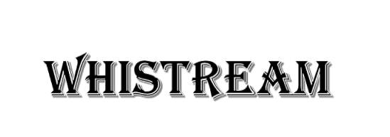

# Whisream

#### Whistream（微流）是基于Whisper语音识别的的在线字幕生成工具，支持rtsp/rtmp/mp4等视频流在线语音识别

## 1. whistream介绍

#### whistream将在whishow基础上引入whisper进行在线语音识别生成视频字幕

## 2. 使用

python：

    python whistream.py <视频路径>
    例1：python whistream.py ./test.mp4
    例2：python whistream.py rtmp://mobliestream.c3tv.com:554/live/goodtv.sdp

命令行：

    ./whistream.exe <视频路径>

在线直播字幕：

## 3. 联系我们
605686962@qq.com
coolEphemeroptera@gmail.com

